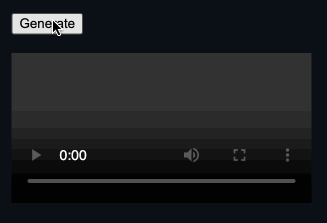

# ffmpeg wasm Canvas Demo

Demonstration of generating video from a canvas animation in the browser with [ffmpeg.wasm](https://github.com/ffmpegwasm/ffmpeg.wasm)

## How to run
Install npm dependencies and start the dev server as follows:
```
npm i
npm run dev
```
Once it starts it will print something like `ready - started server on 0.0.0.0:3000, url: http://localhost:3000`. Navigate to the url in a browser and click the `Generate` button, which you can then play.


